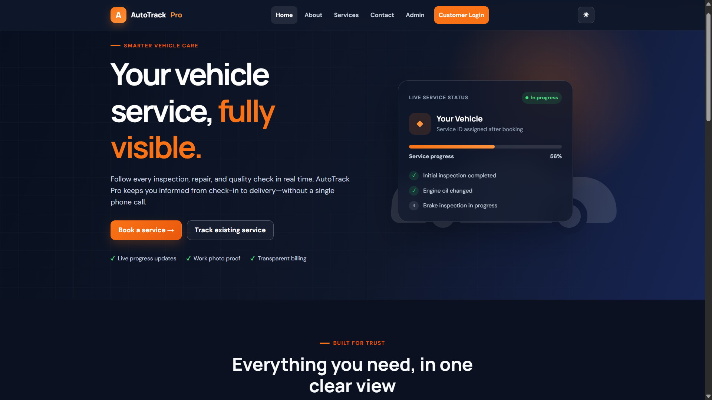
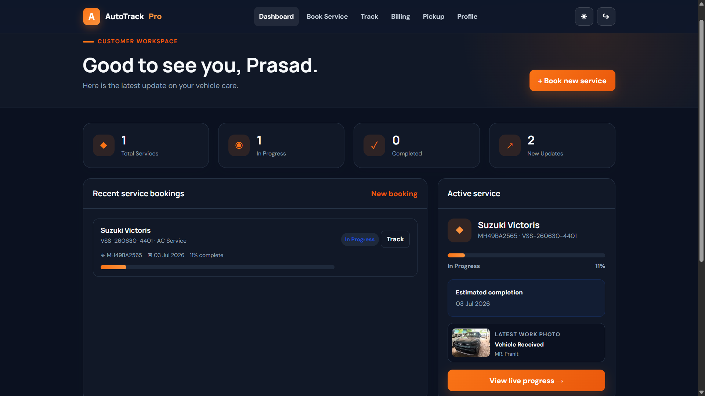
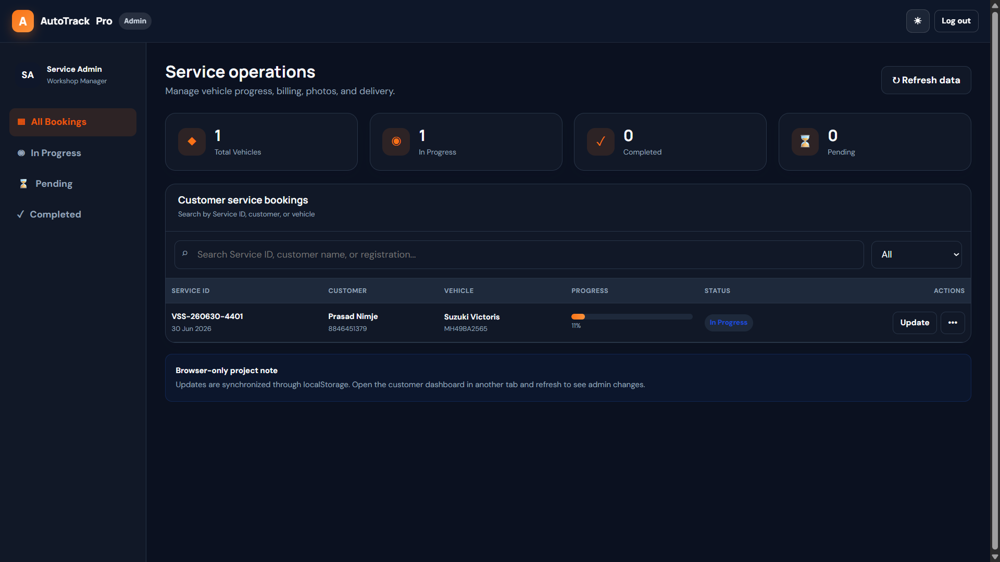
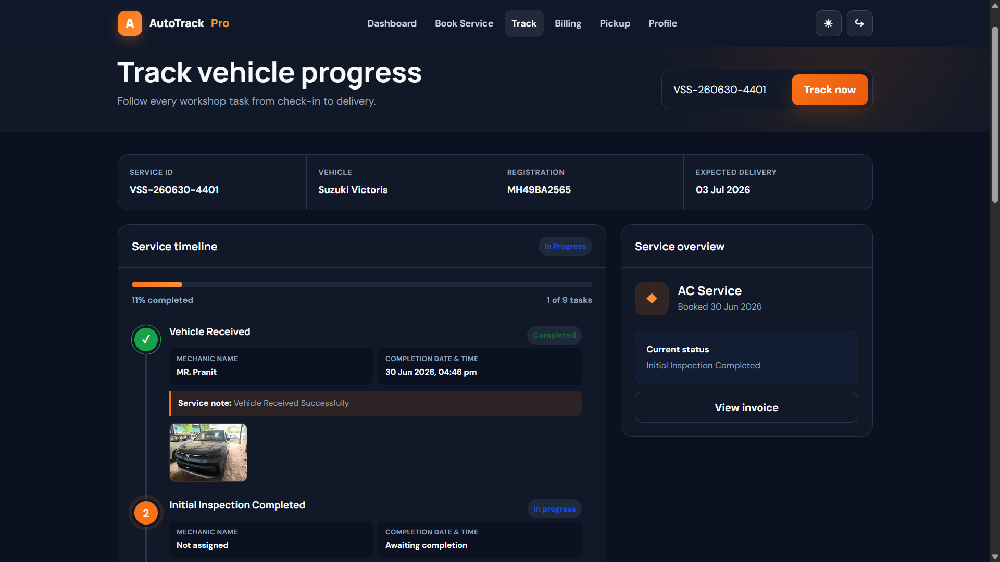
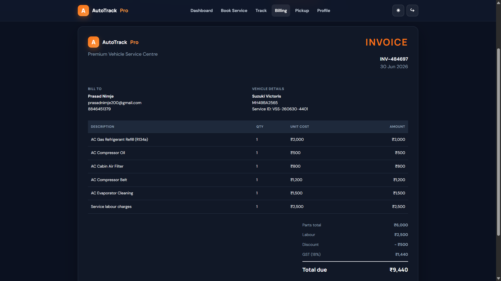

# Vehicle Service Progress Tracking and Management System

**AutoTrack Pro** is a complete Final Year B.Tech front-end project built with only HTML, CSS, and vanilla JavaScript. It lets customers book vehicle services and track workshop progress while administrators manage service tasks, photos, invoices, and pickup schedules.

## Technology

- HTML5
- CSS3
- Vanilla JavaScript
- Browser `localStorage`
- No framework, build tool, server, or database

## Quick start

1. Download or clone this folder.
2. Open `index.html` in a modern browser.
3. Create a customer account, book a service, and use the generated Service ID.

No installation or terminal command is required.

No customer or vehicle records are preloaded. The private default administrator credentials are configured only in `js/admin.js` and are intentionally not shown in the interface or documentation.

> Because this is a static educational project, client-side credentials and localStorage cannot provide server-grade security. A public production deployment should move authentication and data to a secure backend.

## Live Demo

https://prasad29113004.github.io/AutoTrack-Pro/

## Screenshots

### Home Page


### Customer Dashboard


### Admin Dashboard


### Tracking Page


### Billing Page


## Main features

### Customer portal

- Registration, login, simulated password reset, and logout
- Service booking with automatic unique Service ID
- Customer dashboard with statistics and notifications
- Visual service timeline and overall progress bar
- Vehicle details and expected completion date
- Technician notes and uploaded work image gallery
- Itemised spare-parts and labour invoice
- Browser print / Save as PDF invoice
- Pickup and delivery schedule
- Editable customer profile and password
- Light and dark themes
- Responsive desktop, tablet, and mobile layouts

### Admin portal

- Separate administrator login and protected dashboard
- Booking list with Service ID, customer, vehicle, progress, and status
- Search by Service ID, customer name, or vehicle registration
- Filter Pending, In Progress, and Completed services
- Complete individual timeline tasks and add notes
- Upload up to three compressed service images per update
- Record the responsible mechanic for each service task
- Change expected delivery date
- Create or edit invoices, spare parts, labour, discount, and GST
- Schedule self-pickup or home delivery
- Mark a vehicle ready and notify the customer
- Delete completed records with confirmation
- Dashboard statistics for total, pending, in-progress, and completed vehicles

## Data storage

The project stores application data in the current browser using `localStorage`:

- `vss_users` — customer accounts
- `vss_bookings` — bookings, timeline, notifications, invoice, images, and pickup
- `vss_session` — signed-in customer session
- `vss_admin_session` — administrator session
- `vss_theme` — light or dark theme preference

Uploaded images are resized and compressed to JPEG Data URLs, then saved as structured image records inside the selected service task. Source files are limited to 6 MB and a maximum of three images can be added in one update.

To reset all local data, open browser Developer Tools → Application/Storage → Local Storage, clear this site's storage, and reload. The application restarts with empty customer and booking lists.

## Project structure

```text
AutoTrack-Pro/
├── index.html
├── login.html
├── register.html
├── dashboard.html
├── admin-login.html
├── admin-dashboard.html
├── booking.html
├── tracking.html
├── billing.html
├── pickup.html
├── profile.html
├── contact.html
├── about.html
├── css/
│   └── style.css
├── js/
│   ├── auth.js
│   ├── dashboard.js
│   ├── admin.js
│   ├── booking.js
│   ├── billing.js
│   ├── tracking.js
│   └── storage.js
├── images/
├── uploads/
└── README.md
```

## GitHub Pages deployment

1. Create a new GitHub repository.
2. Upload the contents of `vehicle-service-system` to the repository root.
3. Commit and push the files.
4. Open the repository's **Settings**.
5. Select **Pages** in the left sidebar.
6. Under **Build and deployment**, choose **Deploy from a branch**.
7. Select the `main` branch and `/ (root)` folder, then click **Save**.
8. GitHub will provide the public Pages URL after deployment finishes.

Because all links are relative and there is no server-side code, the project works directly on GitHub Pages.

## Suggested project demonstration

1. Register a customer and create a vehicle-service booking.
2. Copy the automatically generated Service ID.
3. Open the administrator portal in another tab and find the booking.
4. Complete a task, enter the mechanic name and service note, and upload an image.
5. Return to the customer tracking page to show the automatic task and photo update.
6. Create an invoice and pickup schedule from the administrator action menu.
7. Show the customer billing page and browser print preview.

## Academic extension ideas

- Connect Firebase, Supabase, PHP/MySQL, or another backend
- Add OTP and email notifications
- Add payment gateway integration
- Store uploaded images in cloud object storage
- Add technician roles and service-bay assignments
- Generate analytics reports and maintenance reminders

---

Built as a beginner-friendly Final Year B.Tech project demonstrating a complete browser-based management workflow.

---

## Author

**Prasad Nimje**

GitHub: https://github.com/Prasad29113004

---

## Copyright

© 2026 Prasad Nimje. All rights reserved.

This project was developed as a final-year academic project.

Unauthorized commercial use, redistribution, or academic submission without permission is prohibited.

This project is intended for educational and portfolio purposes only.

